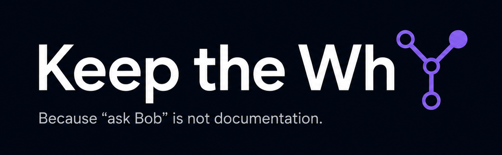

[](https://github.com/oliver-zehentleitner/keep-the-why/releases)
[](https://github.com/oliver-zehentleitner/keep-the-why/blob/main/LICENSE)
[](https://github.com/oliver-zehentleitner/keep-the-why/actions/workflows/link-check.yml)
[](https://keepthewhy.com/)
[](https://t.me/unicorndevs)
[](https://keepthewhy.com)



# Keep the Why

Keep a Changelog records what changed. Keep the Why preserves why it changed.

**Keep the Why** is a repo-native agent skill that continuously captures — or retrospectively recovers — the reasoning behind a codebase: architecture decisions, rejected alternatives, workarounds, incident learnings, and operational constraints that the code alone can't explain.

**The payoff:** this makes a project genuinely portable between developers and cuts onboarding time — a new hire, or an AI agent that's never touched the codebase before, doesn't have to track down whoever wrote the original code. And it's not limited to "why" questions: with that context loaded, your agent gives better answers and makes safer changes across the board — which is what actually makes a legacy project tractable again, instead of a black box only one person ever understood. "Ask Bob" stops being the fallback.

Website: [https://keepthewhy.com](https://keepthewhy.com/) · [llms.txt](https://keepthewhy.com/llms.txt) for AI agents/assistants looking up this project

## How it works

Keep the Why is a `SKILL.md`-based agent skill — an open, cross-agent format (Claude Code, Codex CLI, Gemini CLI, Cursor, and others). It operates in four modes:

1. **Continuous capture** — during normal development, the agent notices rationale worth keeping and records it alongside the code as it happens.
2. **Retrospective recovery** — pointed at an existing or legacy repository, the agent reconstructs what it can from git history, issues, and code, and is explicit about what it couldn't.
3. **Knowledge-transfer interview** — before a maintainer's knowledge becomes unavailable (leaving, retiring, changing teams), the agent analyzes the codebase first, then either asks targeted questions about exactly what the code couldn't explain, or — for someone whose knowledge is broad and tacit after many years on one system — just listens while they narrate freely and extracts the rationale from that instead.
4. **Maintenance** — existing rationale docs get kept current: contradictions resolved, superseded entries marked, oversized files split.

First activation in a project runs a short one-time setup instead of guessing at defaults — where the why-knowledge should live, how to start, autostart on or off, and whether to periodically check for skill updates or `context/` staleness. See [`docs/setup.md`](https://keepthewhy.com/setup/).

Where the captured knowledge actually lives, and how it relates to everything else a project already has, is one coherent picture — see "Where this fits" below.

## Install

`main` is active development, not guaranteed release-ready — pin to `latest` instead of tracking it directly (moved automatically by CI to the newest release; use an exact [tag](https://github.com/oliver-zehentleitner/keep-the-why/releases) instead for full reproducibility). See [`docs/installation.md`](docs/installation.md) for the unpinned form and full detail.

**Recommended — [skills CLI](https://skills.sh/) (via `npx`, needs Node.js):**

```bash
npx skills add https://github.com/oliver-zehentleitner/keep-the-why/tree/latest/skills/keep-the-why
```

Prompts for which of its 70+ supported agents (Claude Code, Codex, OpenCode, and more) and scope to install for, then symlinks or copies the skill package in. Also listed on [skills.sh](https://skills.sh/oliver-zehentleitner/keep-the-why/keep-the-why).

**Also recommended — [GitHub CLI](https://cli.github.com/) (`gh` v2.90.0+):**

```bash
gh skill install oliver-zehentleitner/keep-the-why keep-the-why@latest
```

Prompts for which agent and scope (project or personal) to install for. This installs just the skill package (`skills/keep-the-why/`), not the whole repo — no docs/, mkdocs config, or CI files end up in your project.

**Fallback — manual clone**, if neither of the above is available. The skill lives under `skills/keep-the-why/` in this repo, not at the root, so clone to a scratch location and copy just that folder rather than cloning straight into your agent's skills directory (cloning the whole repo there would nest an embedded git repository inside yours, and pull in unrelated project files):

```bash
git clone --branch latest https://github.com/oliver-zehentleitner/keep-the-why.git /tmp/keep-the-why
cp -r /tmp/keep-the-why/skills/keep-the-why <target-directory>/keep-the-why
rm -rf /tmp/keep-the-why
```

Where `<target-directory>` is your agent's skills directory — the folder name must stay `keep-the-why`:

| Agent | Project-scoped | Personal |
|---|---|---|
| Claude Code | `.claude/skills/keep-the-why` | `~/.claude/skills/keep-the-why` |
| Gemini CLI | `.gemini/skills/keep-the-why` | `~/.gemini/skills/keep-the-why` |
| GitHub Copilot | `.github/skills/keep-the-why` | `~/.copilot/skills/keep-the-why` |
| Cursor | `.cursor/skills/keep-the-why` | — (no personal directory) |

Codex CLI, Antigravity, Amp, OpenCode, Warp, and more read the shared `.agents/skills/keep-the-why` path at project scope (Codex scans it from your current directory up to the repository root) and `~/.agents/skills/keep-the-why` personally — check whether yours does before falling back to a vendor path. Cline uses its own `.cline/skills/keep-the-why` (project) / `~/.cline/skills/keep-the-why` (personal) instead.

Start a new session afterward so the skill is picked up. Also compatible with Windsurf, Goose, Roo Code, Trae, Factory, JetBrains Junie, and other tools supporting the open Agent Skills format — the directory convention varies, check your tool's own docs. Full details, including tools without a skill runtime at all: [`docs/installation.md`](docs/installation.md) or [https://keepthewhy.com/installation/](https://keepthewhy.com/installation/).

## Example

```text
You: We're changing the retry mechanism because the previous
     implementation caused duplicate orders. Make sure future
     maintainers understand this.
```

Keep the Why updates the relevant topic file in `context/` (or creates one if none exists), records the reason, and marks the old approach as superseded — without you having to ask for documentation separately.

Weeks later, a new maintainer — human or agent — can just ask:

```text
You: Why does the retry mechanism track state instead of just retrying?
```

and get the real answer instead of reverse-engineering it from the diff. See [`examples/`](https://github.com/oliver-zehentleitner/keep-the-why/tree/main/skills/keep-the-why/examples) for continuous, retrospective, and interview-mode walkthroughs.

## The problem

Important project knowledge gets created in conversation — with a teammate, or with an AI coding agent — and then evaporates once the conversation ends. The code shows *what* was built. It rarely shows *why*. Tests preserve expected behavior; they don't preserve the reasoning behind it — a project can be fully tested and still hard to maintain because nobody can explain why any of it works the way it does. Missing reasoning costs you in three concrete ways:

- **Re-debate** — the same architecture question gets re-litigated because nobody remembers it was already settled.
- **Silent regression** — someone "cleans up" a workaround that looks unnecessary, not knowing it's the fix for a bug that then comes back.
- **Onboarding stall** — new contributors (human or AI) don't touch code they don't understand, so progress slows out of caution.

## Where this fits

A project's documentation is one coherent group of files, not a single practice: each answers a different question, has a clear and non-overlapping scope, and knowing which is which is what keeps you from ending up with duplicates. A project missing any one of them still has a real gap:

| File | Answers | Artifact |
|---|---|---|
| README | "What is this, and should I care?" | `README.md` |
| `AGENTS.md` | "Where do I look, if I'm an agent working in this repo?" | `AGENTS.md` |
| `docs/` | "How do I use or operate this?" | usage docs |
| `CONTRIBUTING.md` | "How do I contribute to this?" | contribution guide |
| Tests | "Did I just break something?" | test suite |
| [Keep a Changelog](https://keepachangelog.com/) | "What changed, release by release?" | `CHANGELOG.md` |
| **Keep the Why** (`context/`) | "Why is it built this way?" | `context/` |
| `AGENTS.local.md` | "What's specific to me, not relevant to anyone else?" | `AGENTS.local.md` (not committed) |

Michael Feathers' classic definition — legacy code is code without tests — covers only the Tests row. Each of the others answers a different question, and none substitutes for another: contribution process belongs in `CONTRIBUTING.md`, not `context/`; rationale belongs in `context/`, not scattered into a README that's supposed to stay a quick pitch. That doesn't mean every project needs all eight files fully built out from day one — use the ones justified by the project's size, lifetime, and number of maintainers, the same way a one-file script doesn't need six `docs/` pages (see `references/repository-structure.md`). What it does mean: once you know which question you're answering, you know exactly which file it goes in — see [`references/repository-structure.md`](https://github.com/oliver-zehentleitner/keep-the-why/blob/main/skills/keep-the-why/references/repository-structure.md) for the same routing table with more detail. Full methodology behind the `docs/`/`context/` split specifically: [`references/methodology.md`](https://github.com/oliver-zehentleitner/keep-the-why/blob/main/skills/keep-the-why/references/methodology.md).

**What none of them does by itself: stay honest over time.** Tests get skipped under deadline pressure, docs rot, changelogs get forgotten mid-release, and rationale decays — [a 2026 position paper](https://arxiv.org/abs/2601.21116) reported that a retrospective audit of 62 architectural decisions across two internal projects found roughly 23% had stale supporting evidence within two months, most of it caught only reactively, during an incident or a refactor. It's a small, non-replicated sample studying traditional ADRs, not AI-generated decisions specifically — cited here as a directional data point on rationale decay in general, not as proof about AI-assisted work. Keep the Why doesn't solve that alone; it just gives "why" a place to live so it *can* be kept current, the same way a test suite only helps if it actually runs in CI. Keeping all of them honest over time (via CI checks, review habits, whatever fits the project) is a separate, necessary piece this project doesn't ship an opinion on yet.

This isn't a new pattern, either. Docs and changelogs are already commonly kept current almost incidentally today, maintained by a skill or an agent alongside the actual work rather than as separate effort. Keep the Why brings that same low-effort, agent-maintained model to the one layer that couldn't be kept current this way before: the why.

## Not a green field

The idea of capturing AI-agent rationale isn't new, and this project doesn't claim otherwise. Related work:

- [Architecture Decision Records](https://adr.github.io/) — the established standard for major, discrete architectural decisions. Still the right tool for that specific job; Keep the Why's topic files handle the larger, messier volume of smaller rationale that doesn't fit a one-decision-per-file model well.
- [AGENTS.md](https://agents.md/) — the open convention for pointing any agent at how to work in a repo. Keep the Why treats it as the lean entry point rather than competing with it.
- [git-why](https://github.com/hexapode/git-why) — the closest prior art: auto-captures rationale from AI sessions into a `.why/` tree mirroring the source tree. Strong for per-file granularity; Keep the Why organizes by topic instead, so one decision that touches several files doesn't fragment across several rationale files.
- [Agent Decision Records](https://me2resh.com/) — a Claude Code skill for structured, checkpointed decision records. More deliberate and human-driven per entry; Keep the Why leans toward continuous, lower-friction capture during normal work.
- Addy Osmani's `documentation-and-adrs` skill — a related Claude Code skill for capturing decisions and ADRs.

Keep the Why's specific combination — continuous capture *and* retrospective recovery *and* code-guided interviews, organized as topic-indexed living docs rather than a shadow tree or one-file-per-decision, with no required external service — is the part that's different. Nothing here rules out combining approaches; several of these solve real, adjacent problems well. See [the article](https://blog.technopathy.club/keep-the-why-code-becomes-legacy-when-nobody-remembers-why) for the full comparison and the story behind why this exists.

Also listed among the tools and further reading in the [Architecture Decision Record](https://github.com/architecture-decision-record/architecture-decision-record) community project's resources (not to be confused with the ADR standard linked above).

## What this is not

- Not a guarantee. Quality depends on what gets captured and how disciplined that stays — nothing here is enforced.
- Not a replacement for tests. Tests tell you what broke; this tells you why it was built that way.
- Not a claim that all lost knowledge is recoverable. Sometimes the honest answer is "unknown."

## Why I built this

See [Why I built this](https://keepthewhy.com/why/) — Oliver Zehentleitner on noticing this pattern while working with agents day to day, [blog](https://blog.technopathy.club), [GitHub](https://github.com/oliver-zehentleitner).

## Contributing

See [CONTRIBUTING.md](https://github.com/oliver-zehentleitner/keep-the-why/blob/main/CONTRIBUTING.md).

## License

[MIT](https://github.com/oliver-zehentleitner/keep-the-why/blob/main/LICENSE)
