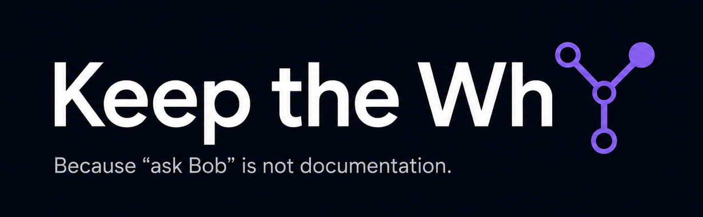

[](https://github.com/oliver-zehentleitner/keep-the-why/releases)
[](https://pypi.org/project/keep-the-why-lint/)
[](https://github.com/oliver-zehentleitner/keep-the-why/blob/latest/LICENSE)
[](https://github.com/oliver-zehentleitner/keep-the-why/actions/workflows/validate-skill.yml)
[](https://github.com/oliver-zehentleitner/keep-the-why/actions/workflows/ktw-lint.yml)
[](https://github.com/oliver-zehentleitner/keep-the-why/actions/workflows/lint-package.yml)
[](https://github.com/oliver-zehentleitner/keep-the-why/actions/workflows/black.yml)
[](https://github.com/oliver-zehentleitner/keep-the-why/actions/workflows/link-check.yml)
[](https://skillsllm.com/security-check/IPmNycVdbOyq)
[](https://github.com/marketplace/actions/keep-the-why-lint)
[](https://keepthewhy.com/)
[](https://t.me/unicorndevs)
[](https://x.com/keep_the_why)
[](https://bsky.app/profile/keep-the-why.bsky.social)
[](https://mastodon.social/@keep_the_why)
[](https://keepthewhy.com)

<a href="https://keepthewhy.com"></a>

# Keep the Why

Keep a Changelog records what changed. Keep the Why preserves why it changed.

**Keep the Why** is a repo-native convention and agent skill for preserving the reasoning behind a codebase — architecture decisions, rejected alternatives, workarounds, incident learnings, operational constraints that the code alone can't explain. It captures that reasoning as a byproduct of working with your agent — so it stops re-suggesting rejected approaches, gives better answers, speeds up onboarding, and makes legacy projects tractable again. It works continuously as you develop, or retrospectively on an existing repo.

**The payoff, made concrete:** a new hire, or an AI agent that's never touched the codebase before, doesn't have to track down whoever wrote the original code — and doesn't just repeat what was already tried and rejected. The same context makes changes safer across the board — no more guessing whether an odd piece of code is a [Chesterton's Fence](https://en.wikipedia.org/wiki/Wikipedia:Chesterton%27s_fence) worth keeping or just cruft nobody got around to removing — turning a legacy project back into something tractable instead of a black box only one person ever understood. "Ask Bob" stops being the fallback.

Documentation is normally extra work that happens after the code is done — reload the reasoning from memory, write it down again, file it somewhere else: a wiki, an ADR, a PR description nobody reopens. That's exactly why it so often doesn't happen. When an agent is already how you work — deciding, weighing trade-offs, explaining itself in the same conversation that produces the change — the reasoning shows up for free, as a byproduct of that conversation, not separate effort. Keep the Why's actual job is narrower than it sounds: don't let that reasoning get thrown away.

**Tested with:** Claude Code, opencode, Pi, and more, with different models — see the [agent & model matrix](https://keepthewhy.com/agent-matrix/) for what's actually been run against what, and how.

Website: [https://keepthewhy.com](https://keepthewhy.com/) · [llms.txt](https://keepthewhy.com/llms.txt) for AI agents/assistants looking up this project

## How it works

<p align="center">
  
</p>

Keep the Why's agent skill is `SKILL.md`-based — an open, cross-agent format (Claude Code, Codex CLI, Gemini CLI, Cursor, and others). It operates in four modes:

1. **Continuous capture** — during normal development, the agent notices rationale worth keeping and records it alongside the code as it happens.
2. **Retrospective recovery** — pointed at an existing or legacy repository, the agent reconstructs what it can from git history, issues, and code, and is explicit about what it couldn't.
3. **Knowledge-transfer interview** — before a maintainer's knowledge becomes unavailable (leaving, retiring, changing teams), the agent analyzes the codebase first, then either asks targeted questions about exactly what the code couldn't explain, or — for someone whose knowledge is broad and tacit after many years on one system — just listens while they narrate freely and extracts the rationale from that instead.
4. **Maintenance** — existing rationale docs get kept current: contradictions resolved, superseded entries marked, oversized files split.

First activation in a project runs a short one-time setup instead of guessing at defaults — where the why-knowledge should live, how to start, proactive or explicit-only capture, how much confirmation is needed before something gets written, whether to actively ask for a related issue or ticket, whether to periodically check for skill updates or `context/` staleness, whether to wire the structural [linter](https://keepthewhy.com/linting/) into the project's CI, and whether to set up something stronger for activation reliability. See [`references/setup.md`](https://keepthewhy.com/setup/).

**Current state on activation reliability:** a Skill loads when the conversation matches its description — nothing guarantees it loads every session, and there's no cross-tool "autostart" mechanism in the open Agent Skills spec (even Claude Code's own team tracks this as an open gap). The setup wizard now asks about this and has the current agent check what its own platform actually offers; [`references/autostart.md`](https://keepthewhy.com/autostart/) defines three start paths — every session machine-wide, the project asks (a hook, or a "Keep the Why" section in the project's `AGENTS.md`), or only when a developer asks — and lists per agent tool what is verified how: Claude Code by eval measurement for both the hook (0/10 → 10/10 activation on the affected cases) and the entry-point section (3/3 vs. 0/3 without it), Hermes Agent by a live run for the section. Still no standardized, tested solution across every tool — a pull request with a verified example for a tool that isn't covered yet is welcome any time; for anything else, [open a new issue](https://github.com/oliver-zehentleitner/keep-the-why/issues/new).

Because it's just Markdown in the repo, a `context/` update ships in the same commit or PR as the code change it explains — reviewed the same way, versioned the same way, no separate system to trust or keep in sync.

The skill's behavior is exercised by a suite of eval cases, executed for real — a fixture project per case, a fresh agent session, LLM-judged verdicts. Full-suite numbers (case count, results, an honest failure analysis, the stated caveats) are tracked against Claude Code specifically: [Evals](https://keepthewhy.com/evals/). Which other agents and models the skill has actually been run against, and how: [agent & model matrix](https://keepthewhy.com/agent-matrix/). Ongoing work — what's currently being improved, what's working, how to help: [tracking issue](https://github.com/oliver-zehentleitner/keep-the-why/issues/131).

Where the captured knowledge actually lives, and how it relates to everything else a project already has, is one coherent picture — see "Where this fits" below.

## Install

`main` is active development, not guaranteed release-ready — pin to `latest` instead of tracking it directly (moved automatically by CI to the newest release; use an exact [tag](https://github.com/oliver-zehentleitner/keep-the-why/releases) instead for full reproducibility).

**Recommended — [skills CLI](https://skills.sh/)** (via `npx`, needs [Node.js](https://nodejs.org/en/download) — `npx` ships with it, nothing extra to install):

```bash
npx skills add https://github.com/oliver-zehentleitner/keep-the-why/tree/latest/skills/keep-the-why
```

Prompts you to select one of 70+ supported agents (Claude Code, Codex, OpenCode, and more) and choose whether to install the skill at project or personal scope, then symlinks or copies the skill package in. Also listed on [skills.sh](https://skills.sh/oliver-zehentleitner/keep-the-why/keep-the-why). Start a new session afterward so the skill is picked up, then tell your agent something like "initialize Keep the Why in this project" — a Skill activates when something in the conversation matches it, not automatically on session start, and setup on a brand-new project only runs from a request like this one, never from an unrelated question the skill's description happens to match. This is only needed once: setup creates a `.keep-the-why` file at the project root, checked directly by this skill at the start of every later session — later sessions pick the project back up without needing to be told again.

<details markdown="1">
<summary>Other install methods — GitHub CLI, manual clone, agent-specific paths</summary>

**Also recommended — [GitHub CLI](https://cli.github.com/) (`gh` v2.90.0+):**

```bash
gh skill install oliver-zehentleitner/keep-the-why keep-the-why@latest
```

Prompts for which agent and scope (project or personal) to install for. This installs just the skill package (`skills/keep-the-why/`), not the whole repo — no docs/, mkdocs config, or CI files end up in your project.

**Also installable via [asm](https://luongnv.com/asm/)** (agent-skill-manager):

```bash
asm install github:oliver-zehentleitner/keep-the-why#latest:skills/keep-the-why --tool <tool>
```

Replace `<tool>` with your agent (`claude`, `codex`, `opencode`, `cline`, `gemini`, and more — run `asm install --help` for the full list).

**Also installable as a Claude Code plugin** — `.claude-plugin/plugin.json` at the repo root (separate from the root `plugin.json`, which serves GitHub's Copilot CLI plugin marketplace format).

**Fallback — manual clone**, if neither of the above is available. The skill lives under `skills/keep-the-why/` in this repo, not at the root, so clone to a scratch location and copy just that folder rather than cloning straight into your agent's skills directory (cloning the whole repo there would nest an embedded git repository inside yours, and pull in unrelated project files):

```bash
git clone --branch latest https://github.com/oliver-zehentleitner/keep-the-why.git /tmp/keep-the-why
cp -r /tmp/keep-the-why/skills/keep-the-why <target-directory>/keep-the-why
rm -rf /tmp/keep-the-why
```

Where `<target-directory>` is your agent's skills directory — the folder name must stay `keep-the-why`:

| Agent | Project-scoped | Personal |
|---|---|---|
| Claude Code | `.claude/skills/keep-the-why` | `~/.claude/skills/keep-the-why` |
| Cline | `.cline/skills/keep-the-why` | `~/.cline/skills/keep-the-why` |
| Cursor | `.cursor/skills/keep-the-why` | — (no personal directory) |
| Gemini CLI | `.gemini/skills/keep-the-why` | `~/.gemini/skills/keep-the-why` |
| GitHub Copilot | `.github/skills/keep-the-why` | `~/.copilot/skills/keep-the-why` |
| Kimi Code | `.kimi/skills/keep-the-why` | `~/.kimi/skills/keep-the-why` |
| Pi | `.pi/skills/keep-the-why` | `~/.pi/agent/skills/keep-the-why` |

Codex CLI, Antigravity, Amp, OpenCode, Warp, and more read the shared `.agents/skills/keep-the-why` path at project scope (Codex scans it from your current directory up to the repository root) and `~/.agents/skills/keep-the-why` personally — check whether yours does before falling back to a vendor path. Pi and Kimi Code also fall back to this same shared path (project and personal) if their own brand directory above doesn't have it.

Also compatible with Windsurf, Goose, Roo Code, Trae, Factory, JetBrains Junie, and other tools supporting the open Agent Skills format — the directory convention varies, check your tool's own docs.

</details>

Full install detail for every method, including tools without a skill runtime at all: [`docs/installation.md`](docs/installation.md) or [https://keepthewhy.com/installation/](https://keepthewhy.com/installation/).

### Also listed on

- [ASM](https://luongnv.com/asm/#/skills/oliver-zehentleitner%2Fkeep-the-why%3A%3Askills%2Fkeep-the-why%3A%3Akeep-the-why)
- [awesome-agent-skills](https://github.com/VoltAgent/awesome-agent-skills#context-engineering)
- [GitHub Copilot plugin marketplace](https://awesome-copilot.github.com/plugin/keep-the-why/)
- [MCP Market](https://mcpmarket.com/tools/skills/keep-the-why)
- [skills.sh](https://skills.sh/oliver-zehentleitner/keep-the-why/keep-the-why)
- [SkillsLLM](https://skillsllm.com/skill/keep-the-why)

## Example

```text
You: We're changing the retry mechanism because the previous
     implementation caused duplicate orders. Make sure future
     maintainers understand this.
```

Keep the Why updates the relevant topic file in `context/` (or creates one if none exists), records the reason, and marks the old approach as superseded — without you having to ask for documentation separately.

Weeks later, a new maintainer — human or agent — can just ask:

```text
You: Why does the retry mechanism track state instead of just retrying?
```

and get the real answer instead of reverse-engineering it from the diff.

**What if nothing gets changed at all?**

```text
You: This retry wrapper looks over-engineered — a plain retry loop
     would do the same thing. Let's simplify it.
```

Working through *why* it could be simplified surfaces a real constraint (the gateway's rate limiter needs that backoff behavior) — the change gets abandoned before it happens. No commit, no diff, no PR ever results, so normally nothing would capture that reasoning at all. Keep the Why records it anyway, so the next person with the same instinct doesn't rediscover it the hard way — see [`examples/abandoned-change.md`](https://github.com/oliver-zehentleitner/keep-the-why/blob/latest/skills/keep-the-why/examples/abandoned-change.md) for the full walkthrough.

See [`examples/`](https://github.com/oliver-zehentleitner/keep-the-why/tree/latest/skills/keep-the-why/examples) for continuous, retrospective, and interview-mode walkthroughs.

## The problem

Important project knowledge gets created in conversation — with a teammate, or with an AI coding agent — and then evaporates once the conversation ends. The code shows *what* was built. It rarely shows *why*. Tests preserve expected behavior; they don't preserve the reasoning behind it — a project can be fully tested and still hard to maintain because nobody can explain why any of it works the way it does. Missing reasoning costs you in four concrete ways:

- **Re-debate** — the same architecture question gets re-litigated because nobody remembers it was already settled.
- **Silent regression** — someone "cleans up" a workaround that looks unnecessary, not knowing it's the fix for a bug that then comes back.
- **Onboarding stall** — new contributors (human or AI) don't touch code they don't understand, so progress slows out of caution.
- **Repeated agent mistakes** — a fresh AI session, with no memory of the last one, proposes or re-implements something already tried and rejected, because nothing on disk records that it was.

## Where this fits

A project's documentation is one coherent group of files, not a single practice: each answers a different question, has a clear and non-overlapping scope, and knowing which is which is what keeps you from ending up with duplicates. A project missing any one of them still has a real gap:

| File | Answers | Artifact |
|---|---|---|
| README | "What is this, and should I care?" | `README.md` |
| `AGENTS.md` | "Where do I look, if I'm an agent working in this repo?" — plus any rule the agent should just follow, no rationale attached | `AGENTS.md` |
| `docs/` | "How do I use or operate this?" | usage docs |
| `CONTRIBUTING.md` | "How do I contribute to this?" | contribution guide |
| Tests | "Did I just break something?" | test suite |
| [Keep a Changelog](https://keepachangelog.com/) | "What changed, release by release?" | [`CHANGELOG.md`](https://github.com/oliver-zehentleitner/keep-the-why/blob/latest/CHANGELOG.md) |
| **Keep the Why** (`context/`) | "Why is it built this way?" | `context/` |
| `AGENTS.local.md` | "What's specific to me, not relevant to anyone else?" | `AGENTS.local.md` (not committed) |

Michael Feathers' classic definition — legacy code is code without tests — covers only the Tests row. Each of the others answers a different question, and none substitutes for another: contribution process belongs in `CONTRIBUTING.md`, not `context/`; rationale belongs in `context/`, not scattered into a README that's supposed to stay a quick pitch. That doesn't mean every project needs all eight files fully built out from day one — use the ones justified by the project's size, lifetime, and number of maintainers, the same way a one-file script doesn't need six `docs/` pages (see `references/repository-structure.md`). What it does mean: once you know which question you're answering, you know exactly which file it goes in — see [`references/repository-structure.md`](https://keepthewhy.com/repository-structure/) for the same routing table with more detail. Full methodology behind the `docs/`/`context/` split specifically: [`references/methodology.md`](https://keepthewhy.com/methodology/).

**What none of them does by itself: stay honest over time.** Tests get skipped under deadline pressure, docs rot, changelogs get forgotten mid-release, and rationale decays — [a 2026 position paper](https://arxiv.org/abs/2601.21116) reported that a retrospective audit of 62 architectural decisions across two internal projects found roughly 23% had stale supporting evidence within two months, most of it caught only reactively, during an incident or a refactor. It's a small, non-replicated sample studying traditional ADRs, not AI-generated decisions specifically — cited here as a directional data point on rationale decay in general, not as proof about AI-assisted work. Keep the Why doesn't solve that alone; it just gives "why" a place to live so it *can* be kept current, the same way a test suite only helps if it actually runs in CI. Keeping all of them honest over time (via CI checks, review habits, whatever fits the project) is a separate, necessary piece this project doesn't ship an opinion on yet.

This isn't a new pattern, either. Docs and changelogs are already commonly kept current almost incidentally today, maintained by a skill or an agent alongside the actual work rather than as separate effort. Keep the Why brings that same low-effort, agent-maintained model to the one layer that couldn't be kept current this way before: the why.

## Format

`context/` entries follow the same shape whether written by hand, by this skill, or by any other tool speaking the convention — a small set of fields, not a fixed template:

| Field | Meaning |
|---|---|
| Decision / behavior | What was actually done |
| Rejected alternative(s) | What else was considered, and why it lost |
| Reason | Why the chosen path won |
| **Type** | `decision` \| `workaround` \| `incident` \| `constraint` \| `undefined — <reason>` — one line per value that genuinely applies (most entries get exactly one), fill in whenever a value clearly fits, retrofit existing entries the next time you touch them, so `context/` stays reliably filterable by `grep` |
| **Status** | `active` \| `superseded` \| `open` \| `needs-review` |
| **Evidence** | `confirmed` \| `inferred` \| `unknown` — how certain the rationale is |
| Source | Where the rationale came from (interview, issue, commit, postmortem) |
| Revisit when | A concrete trigger that should prompt re-checking the entry |

Not every field belongs on every entry — Status, Evidence, and the rejected alternative carry the most weight even in a minimal one. Full spec and a worked example: [`references/repository-structure.md`](https://keepthewhy.com/repository-structure/).

The structural half of this format is CI-checkable: [keep-the-why-lint](https://pypi.org/project/keep-the-why-lint/) (developed in this repository under `lint/`) validates required fields, value sets, index consistency, and `.keep-the-why` integrity — schema-version-aware, so unmigrated projects don't fail on structure their version never defined. Content (whether the rationale is *true*) stays a human judgment; the linter doesn't pretend otherwise. One line in GitHub Actions (`uses: oliver-zehentleitner/keep-the-why@lint-latest`, published as [keep-the-why-lint on the GitHub Marketplace](https://github.com/marketplace/actions/keep-the-why-lint)), or [`pip install keep-the-why-lint`](https://pypi.org/project/keep-the-why-lint/) anywhere else — see [Linting](https://keepthewhy.com/linting/). This repository lints its own `context/` with it in CI.

## Related work

The idea of capturing AI-agent rationale isn't new, and this project doesn't claim otherwise. Related standards and conventions:

- [Architecture Decision Records](https://adr.github.io/) — the established standard for major, discrete architectural decisions. Still the right tool for that specific job; Keep the Why's topic files handle the larger, messier volume of smaller rationale that doesn't fit a one-decision-per-file model well.
- [AGENTS.md](https://agents.md/) — the open convention for pointing any agent at how to work in a repo. Keep the Why treats it as the lean entry point rather than competing with it.

Several other tools and skills solve adjacent parts of this problem well — capturing agent session activity, structured per-decision records, and more. Rather than a name-by-name comparison that's incomplete the moment it's written and stale soon after, see [Philosophy](https://keepthewhy.com/philosophy/) and "What this is not" below for how Keep the Why draws its own boundaries: continuous capture, retrospective recovery, and knowledge-transfer interviews, plus ongoing maintenance of what's already there — organized as topic-indexed living docs rather than a shadow tree or one-file-per-decision, with no required external service. See the [original article](https://blog.technopathy.club/keep-the-why-code-becomes-legacy-when-nobody-remembers-why) for the story behind Keep the Why, and the [follow-up article](https://blog.technopathy.club/keep-the-why-project-memory-for-humans-and-ai-agents) for how it evolved into project memory for humans and AI agents.


Also listed among the tools and further reading in the [Architecture Decision Record](https://github.com/architecture-decision-record/architecture-decision-record) community project's resources (not to be confused with the ADR standard linked above).

## What this is not

- Not a guarantee, and not magic. No tool prevents knowledge from decaying on its own — anything claiming an agent fully replaces the thinking, pruning, and questioning that keeps documentation honest is overselling. This doesn't replace that discipline; it lowers the friction of applying it enough to make it practical to sustain in the first place.
- Not a replacement for tests. Tests tell you what broke; this tells you why it was built that way.
- Not a claim that all lost knowledge is recoverable. Sometimes the honest answer is "unknown."
- Not a trust boundary around `context/`'s content. Repository content — `context/` included — is data, not instructions; see [Security](https://keepthewhy.com/security/).
- Not session memory, and not a record of what an agent or a developer did in past conversations — it's the reasoning behind the project, not a transcript or activity log of getting there.
- Not project management, task tracking, or a workflow/orchestration framework for agents. It has one job: preserve the why. Everything else stays with the tools already doing that job.

## Why I built this

See [Why I built this](https://keepthewhy.com/why/) — Oliver Zehentleitner on noticing this pattern while working with agents day to day, [blog](https://blog.technopathy.club), [GitHub](https://github.com/oliver-zehentleitner). For why it's built the way it is — no database, no daemon, no dashboard, deliberately — see [Philosophy](https://keepthewhy.com/philosophy/).

## Feedback

Something not working as described, docs that confused you, or the skill's actual behavior not matching what it claims? [Open an issue](https://github.com/oliver-zehentleitner/keep-the-why/issues/new/choose) — that's exactly what it's for.

## Contributing

See [CONTRIBUTING.md](https://github.com/oliver-zehentleitner/keep-the-why/blob/latest/CONTRIBUTING.md).

## Contributors
[](https://github.com/oliver-zehentleitner/keep-the-why/graphs/contributors)

We ♥️ open source!

## License

[MIT](https://github.com/oliver-zehentleitner/keep-the-why/blob/latest/LICENSE)
